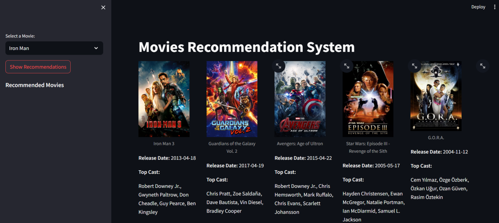

# Movie_Recommendation_System

**## Problem Definition**

In the current landscape of digital media, users face challenges in discovering movies that match their personal preferences amidst a vast array of options. Existing recommendation systems often fail to provide accurate and personalized suggestions, leading to user frustration and decision fatigue. There is a need for an advanced movie recommendation system that utilizes cutting-edge algorithms to analyze user behavior and movie metadata effectively, providing highly personalized suggestions in real-time. This system should adapt dynamically to user feedback to ensure continuous relevance and engagement, revolutionizing the movie-watching experience and enhancing user satisfaction.

